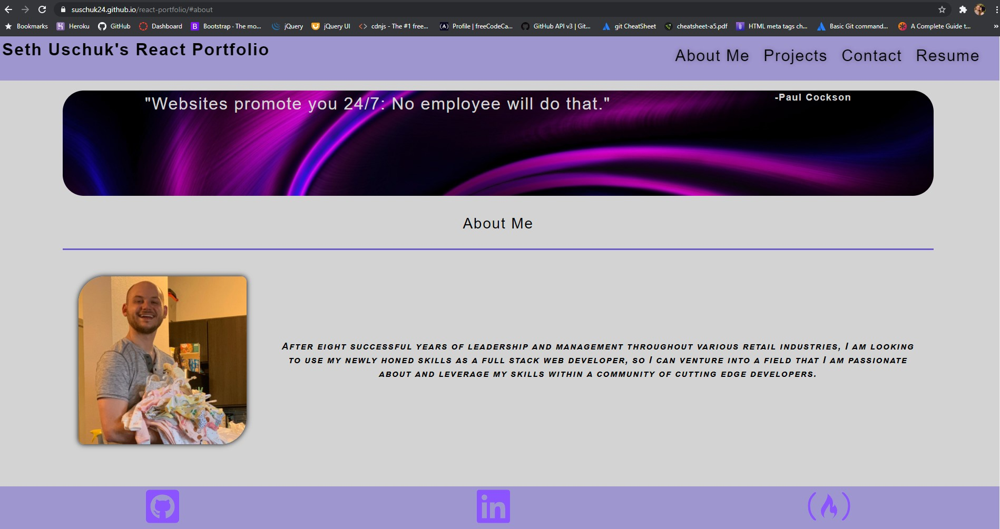
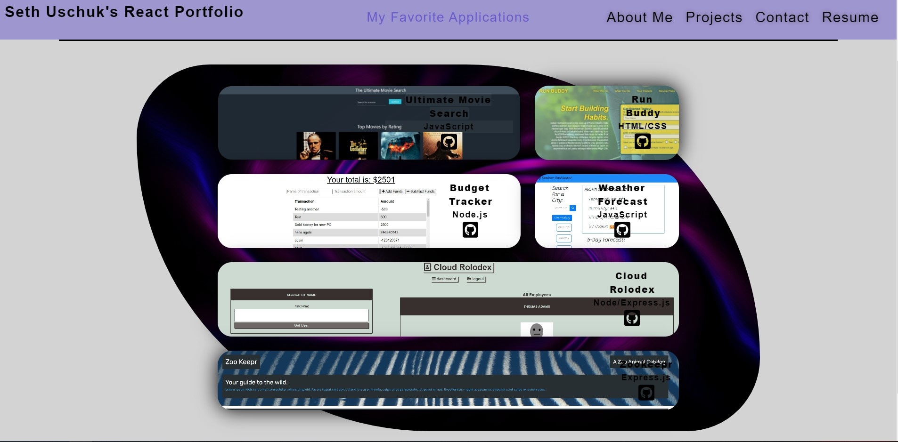
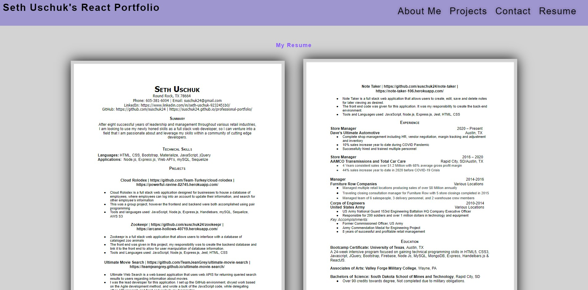

# React Portfolio

## Description:

This is a newer, more powerful version of my professional portfolio, written using the React framework!

 [See the original here:](https://suschuk24.github.io/professional-portfolio)

# Table of Contents 

- [Repository](#repository)
- [Screenshots](#screenshots)
- [User Story](#user%20story)
- [Acceptance Criteria](#Acceptance%20criteria)
- [Contributions](#contributing)
- [Tests](#tests)
- [License](#license)
- [Questions](#questions)
- [Technologies Used](#languages)

## Repository: 
- [My Github Profile](https://github.com/suschuk24)

- [This Repository](https://github.com/suschuk24/react-portfolio)

- [Deployed Application](https://suschuk24.github.io/react-portfolio/)

## Screenshots

## User Story
* AS AN employer looking for candidates with experience building single-page applications
* I WANT to view a potential employee's deployed React portfolio of work samples
* SO THAT I can assess whether they're a good candidate for an open position

## Acceptance Criteria
* GIVEN a single-page application portfolio for a web developer
* WHEN I load the portfolio
* THEN I am presented with a page containing a header, a section for content, and a footer
* WHEN I view the header
* THEN I am presented with the developer's name and navigation with titles corresponding to different sections of the portfolio
* WHEN I view the navigation titles
* THEN I am presented with the titles About Me, Portfolio, Contact, and Resume, and the title corresponding to the current section is highlighted
* WHEN I click on a navigation title
* THEN I am presented with the corresponding section below the navigation without the page reloading and that title is highlighted
* WHEN I load the portfolio the first time
* THEN the About Me title and section are selected by default
* WHEN I am presented with the About Me section
* THEN I see a recent photo of the developer and a short bio about them
* WHEN I am presented with the Portfolio section
* THEN I see titled images of six of the developer’s applications with links to both the deployed applications and the corresponding GitHub repository
* WHEN I am presented with the Contact section
* THEN I see a contact form with fields for a name, an email address, and a message
* WHEN I move my cursor out of one of the form fields without entering text
* THEN I receive a notification that this field is required
* WHEN I enter text into the email address field
* THEN I receive a notification if I have entered an invalid email address
* WHEN I am presented with the Resume section
* THEN I see a link to a downloadable resume and a list of the developer’s proficiencies
* WHEN I view the footer
* WHEN I am presented with text or icon links to the developer’s GitHub and LinkedIn profiles, and their profile on a third platform (Stack Overflow, Twitter) 

## License:
For more information about licenses, please visit:
[License](https://opensource.org/licenses/MIT)

## Contributing:

Seth Uschuk

## Tests:

Testing completed using WebPack, Optimized using Chrome DevTools and Lighthouse, Checked for typos and bugs

## Technologies Used:

* JavaScript
* Node
* Express
* WebPack
* HTML
* CSS

## Questions:

If you have any questions, please see my GitHub Page, or feel free to reach out by email:

-[GitHub's Guide to a Professional README](https://github.com/coding-boot-camp/potential-enigma/blob/master/readme-guide.md)

- [My Github Profile](https://github.com/suschuk24)

- [This Repository](https://github.com/suschuk24/react-portfolio)

- [My Email](test@gmail.com)
